# WARICA

> **AI・開発者の引き継ぎ入口：** [AGENTS.md](AGENTS.md) → [確認済み状態](docs/STATUS.md) → [残課題・完了条件](docs/BACKLOG.md)。作業前にこの順で確認してください。

**楽しい時間の、そのあとに。**

旅行や食事の立て替えを記録し、**誰が・誰に・いくら送るか**を整理する、日本語の割り勘アプリです。初回は「みんなでごはん」とメンバー「A・B」が入っているので、そのまま金額の入力から始められます。

ログイン不要 · ブラウザ内に自動保存 · スマホの片手操作に対応

[使い方](#使い方) · [精算のルール](#精算のルール) · [PayPayとLINE](#paypayとline) · [保存と復旧](#保存と復旧) · [開発](#開発) · [設計](#設計) · [テスト](#テスト)

## 画面を見る

メンバーを決め、支払いを記録し、精算結果を共有する3画面です。以下はAが食事代3,000円を立て替え、A・Bの2人で分ける例です。

<table>
  <tr>
    <th>1. メンバー</th>
    <th>2. 支払い</th>
    <th>3. 精算</th>
  </tr>
  <tr>
    <td>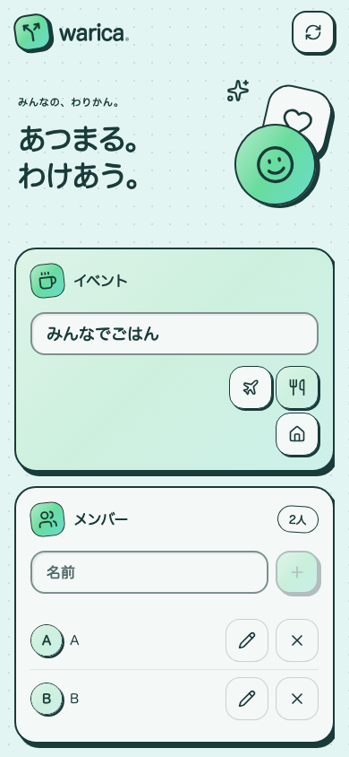</td>
    <td>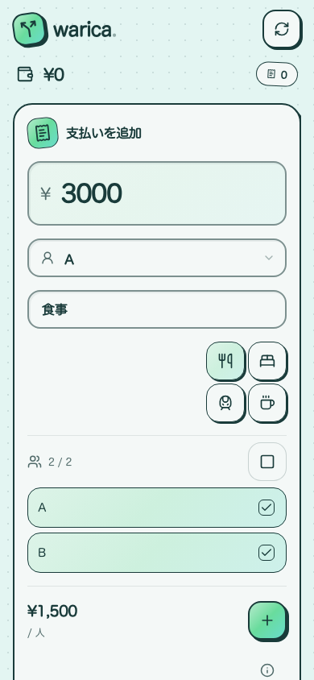</td>
    <td>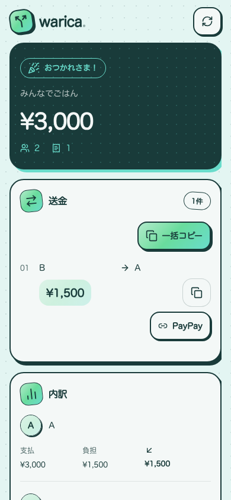</td>
  </tr>
</table>

スクリーンショットは390px幅のローカル本番ビルドで撮影しています。

## 使い方

1. **メンバーを確認する。** 初回のイベント名は「みんなでごはん」、メンバーは「A」「B」。必要なときだけ名前を変えたり、メンバーを増やしたりします。
2. **支払いを記録する。** 金額を入れ、支払った人と割り勘に含める人を選びます。内容は任意で、食事・宿泊・交通・カフェのアイコンからも入力できます。
3. **精算結果を共有する。** 矢印で精算画面へ進み、「一括コピー」で全員分の送金内容をLINEなどに貼り付けます。

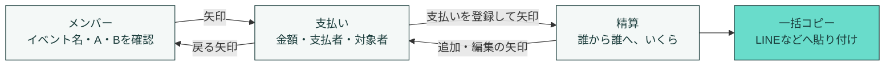

支払い画面にはイベント名と2人以上のメンバー、精算画面にはさらに1件以上の支払いが必要です。保存済みのイベントや、意図的に空にした名前・メンバーを初期値で上書きしません。

### 入力を少なくする工夫

| 操作                 | 挙動                                                                             |
| -------------------- | -------------------------------------------------------------------------------- |
| 金額の貼り付け       | 全角数字や正しい桁区切りを受け付け、小数・曖昧な区切りは勝手に金額へ変換しません |
| 続けて支払いを追加   | 支払者と対象者を引き継ぎ、次の金額を入力できます                                 |
| 入力中に画面を移動   | 新規入力と編集中の下書きを別々に保持します                                       |
| メンバーを追加       | 入力開始済みの下書きや、登録済みの支払いに自動で含めません                       |
| 下書きの対象者を削除 | 金額・内容を残し、支払者の選び直しや対象者の確認を求めます                       |
| 過去の支払いを探す   | 新しい順に20件ずつ表示。内容・支払者・対象者の名前で全件検索できます             |

検索は全角・半角を揃え、空白で区切ったすべての語を含む記録に絞ります。**検索・ページ送りで、合計・精算・一括コピーの対象は変わりません。**

### スマホでの操作

- ボタンや対象者チェックは右側に集約し、主な操作に44px以上のタップ領域を確保しています。
- 下部固定の3タブは置かず、ページ内の矢印で移動します。PCではサイドバーからも移動できます。
- 本文を画面下まで使い、ホームインジケーター周辺には余白を確保しています。
- 本文の横スクロールとタップ時のボタン移動を抑え、画面の位置を安定させています。縦スクロールとピンチによる拡大は維持します。
- 右上のリフレッシュアイコンから、確認後に支払い履歴・精算結果・下書き・PayPayリンクをまとめてリセットできます。イベント名とメンバーは残り、次の金額入力へ進みます。デザイン切り替え・「新しく始める」・通常時の管理メニューはありません。

## 精算のルール

**各支払いを対象者だけに分け、各人の「支払額 − 負担額」を相殺します。** 支払った本人を対象者に含めても、外しても構いません。

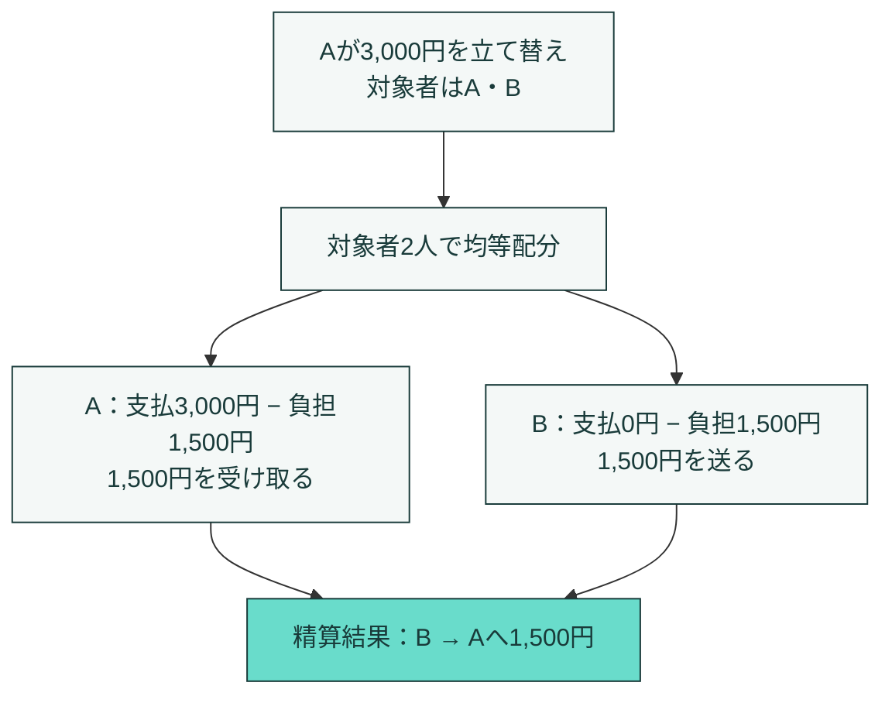

1. 1回の立て替えを1件として保存し、支払者と対象者を名前ではなくIDで保持します。
2. 支払いごとに均等配分します。割り切れない円は、対象者の**メンバー登録順**に1円ずつ割り当てます。選択した順番では変わりません。
3. 各人の差額を計算し、受取額・送金額の大きい人から相殺します。送金は最大で人数−1件です。数学的に最少の件数を常に保証するものではありません。

| 立て替え                | 対象者               | 負担と精算                                      |
| ----------------------- | -------------------- | ----------------------------------------------- |
| Aが1,000円を支払う      | A・B・C              | 負担はAが334円、B・Cが333円。B・CからAへ各333円 |
| Aが3,000円を支払う      | Bのみ                | BからAへ3,000円。A・Cの負担は0円                |
| Aが1円を支払う          | B・C                 | 登録順がB→CならBの負担は1円、Cは0円             |
| A・Bが各1,000円を支払う | どちらの支払いもA・B | 負担と支払額が一致し、送金は不要                |

支払いに含まれるメンバーは、その支払いを先に編集・削除するまで削除できません。

### 入力と保存の上限

| 項目                       | 上限・条件                                                             |
| -------------------------- | ---------------------------------------------------------------------- |
| イベント名                 | 50文字。支払いを始めるには空欄以外が必要                               |
| メンバー                   | 最大100人。名前は1〜20文字、同名は登録不可                             |
| 1件の金額                  | 1〜1,000,000円。日本円の整数のみ                                       |
| 支払いの内容               | 100文字、入力は任意                                                    |
| 支払い件数                 | 最大10,000件。ただし保存容量の上限が先に適用される場合があります       |
| イベントの保存・復旧用JSON | 2MiB（2,097,152バイト、画面表記は2MB）以内。ブラウザ側の空き容量も必要 |

## PayPayとLINE

### 全員分を一括コピー

精算画面の「一括コピー」は、表示中の履歴に関係なく全員分の送金内容をコピーします。上の3,000円の例では次のテキストになります。

```text
みんなでごはん｜精算結果
合計 ¥3,000 / 2人 / 1件

B → A：¥1,500
```

相手別のコピーにも対応します。クリップボードを使えない場合は、選択してコピーできるテキストを表示します。一括コピーには送金一覧、登録済みPayPayリンクは相手別コピーに含まれます。

### PayPayの請求リンクを使う

WARICAは精算額を計算し、**利用者が登録した請求リンクを開きます**。請求リンクの発行、宛先・金額の照会、実際の送金、送金完了の判定は行いません。

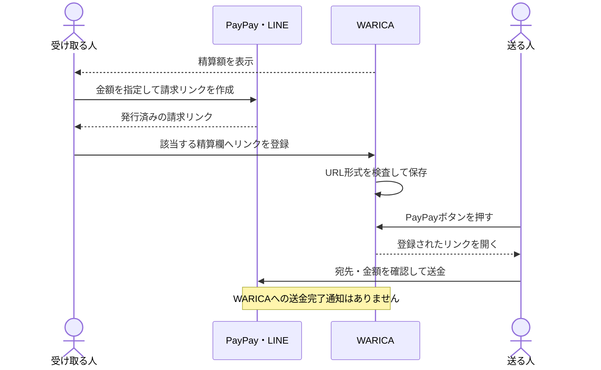

請求リンクは、LINEのトークから「送る・受け取る」を使って作成できます。作成にはPayPayの本人確認が必要です。アプリ側の詳しい操作・利用条件は[PayPay公式ガイド](https://paypay.ne.jp/guide/receive/)を参照してください。

- URLはHTTPSとPayPayのドメイン等を検査します。URLへ金額や宛先を付け足しません。形式の検査だけでは、リンクの種類・期限・宛先・金額の正しさを保証できません。
- 送金者・受取者・氏名・金額が変わると紐づくリンクを解除します。元の金額に戻しても自動復活しません。
- 保存失敗や別タブとの競合中はリンクを開く操作を停止します。旧データの対象者確認が済むまで登録できません。
- PayPayアプリへの遷移は端末・ブラウザ・アプリ設定に依存します。リンクを開くだけでは精算済みにしません。

## 保存と復旧

### どこに何が残るか

| 保存先                           | 内容                                             | 保持範囲                                                   |
| -------------------------------- | ------------------------------------------------ | ---------------------------------------------------------- |
| `localStorage`                   | イベント・メンバー・登録済み支払い・PayPayリンク | 同じブラウザ・同じオリジンで再読み込み後も保持             |
| `localStorage`のバックアップキー | 前回の正常な保存内容                             | 主データの破損時に復元を試みます                           |
| `sessionStorage`                 | 新規支払いと編集中の下書き                       | 同じタブ内の画面移動・再読み込み。タブを閉じると原則終了   |
| 復旧用JSONファイル               | 登録済みイベントとPayPayリンク                   | 利用者が保存するファイル。下書きは含まず、暗号化もしません |

ブラウザ内で扱うイベントは1つです。ログイン、共同編集、クラウド同期、イベント一覧の管理機能はありません。`localhost`と`127.0.0.1`、ポートの違いも保存先が分かれます。

### 通常の保存

画面をまたぐ共有状態に入力を反映し、その場で同期保存を試みます。保存に失敗しても画面の入力を保持し、復旧操作を表示します。

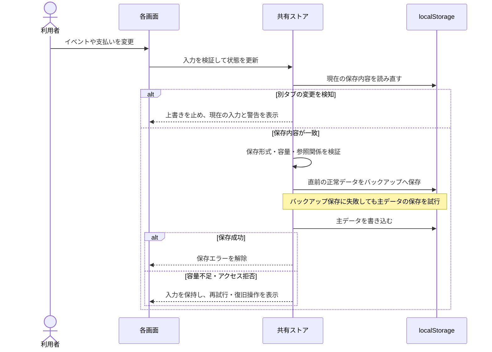

下書きは独立したProviderから`sessionStorage`へ同期保存します。登録済みイベントの更新日時と照合し、別イベントの下書きを復元しません。入力開始時の支払者・対象者を保持し、削除された人を自動で別の人に置き換えません。

ブラウザの通常の再読み込みでは、登録データと支払いの下書きを保持します。右上のリフレッシュは「支払いをリセット」する操作であり、確認画面でキャンセルできます。リセット前の正常な台帳は通常の保存と同じくバックアップキーに保持します。

### 読み込みと復旧の分岐

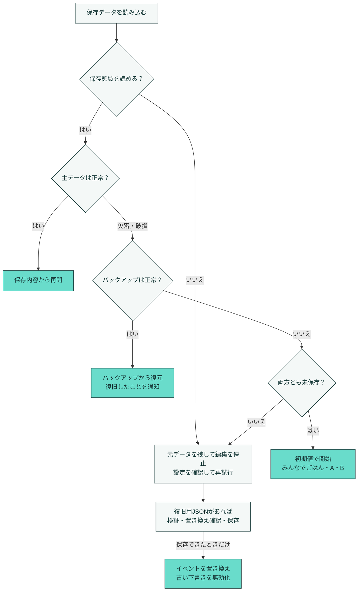

| 状況                         | 操作と保護される内容                                                                                                           |
| ---------------------------- | ------------------------------------------------------------------------------------------------------------------------------ |
| 支払いのリフレッシュ         | 右上の循環矢印から確認後に支払い・精算・下書き・PayPayリンクをリセット。イベント名とメンバーは保持。保存できなければ消しません |
| 保存できない                 | 入力を残して再試行。「バックアップ」「読み込む」は保存トラブル時の復旧パネルに表示                                             |
| 別タブが更新した             | 上書きを止めて通知。確認後に最新データへ切り替え可能。未保存変更と下書きは破棄されるため、必要なら先にバックアップ             |
| 最新データへの切り替えに失敗 | 読み取り・下書き消去に失敗したら切り替えず、現在の入力を保持。最新データをlocalStorageへ書き戻しません                         |
| JSONで置き換える             | ファイル検証・利用者の確認・保存成功後にイベントを置き換え。失敗時は現在のイベントと下書きを維持                               |

別タブの更新は保存前の比較、`storage`イベント、フォーカス復帰時に検知します。これは競合の検知であり、同時編集の自動統合や排他ロックではありません。

保存失敗中はブラウザの再読み込み・離脱にも確認を要求します。ただしOSによる強制終了等では確認できないことがあります。サイトデータを削除するとブラウザ内のバックアップも消えます。通常画面にはJSONの書き出し・読み込みを常設していないため、常時使える端末間移行機能としては提供していません。

### 旧データとの互換性

保存キーは`warican-app-data-v2`と`warican-backup-v2`を引き継ぎます。読み込める保存形式は2.0.0・3.0.0・3.1.0、現在の出力は3.1.0です。チェックサムに加えて全レコードの構造・金額・メンバー参照を検証します。

旧形式で対象者の記録がない支払いには、読み込み時の全員を仮設定し「旧データ・対象者を要確認」を表示します。メモから対象者を推測したり、分割された記録を自動結合したりはしません。支払いを編集して対象者を確認・保存してください。端数の配分も支払い単位なので、旧画面と精算結果が異なる場合があります。不正な金額・参照・未対応バージョンを黙って修正して読み込むことはありません。

### データの通信範囲

入力内容を送信するAPI、ログイン、外部フォントの読み込みはありません。アプリの配信には通信があり、ホスティング側のアクセス記録は別です。PayPayリンク・公式ガイドを開くと外部サイトへ移動します。共有するテキストやJSONには名前・金額・登録したリンクが含まれます。

## 開発

Node.jsは[`.nvmrc`](.nvmrc)に合わせて**24**、pnpmは**10.23.0**を使用します。`package.json`上のNode.js最低要件は22です。環境変数・データベースの設定は不要です。

```sh
git clone git@github.com:bright-broom/warica.git
cd warica
corepack enable
pnpm install --frozen-lockfile
pnpm dev
```

[localhost:3000](http://localhost:3000)を開きます。3100番ポートで開発する場合は次のコマンドです。

```sh
pnpm dev --hostname 127.0.0.1 --port 3100
```

本番ビルドをローカルで動かす場合：

```sh
pnpm build
pnpm start --hostname 127.0.0.1 --port 3100
```

開発サーバーと本番サーバーを同じポートで同時起動しないでください。同じチェックアウトの`.next`を使うサーバーは、再ビルドする前に停止します。

## 設計

### 画面をまたぐ共有状態

3画面は共通のレイアウトの内側で切り替わります。登録済みイベントと編集中の下書きを別のProviderで管理し、計算・検証・永続化をUIから分離しています。

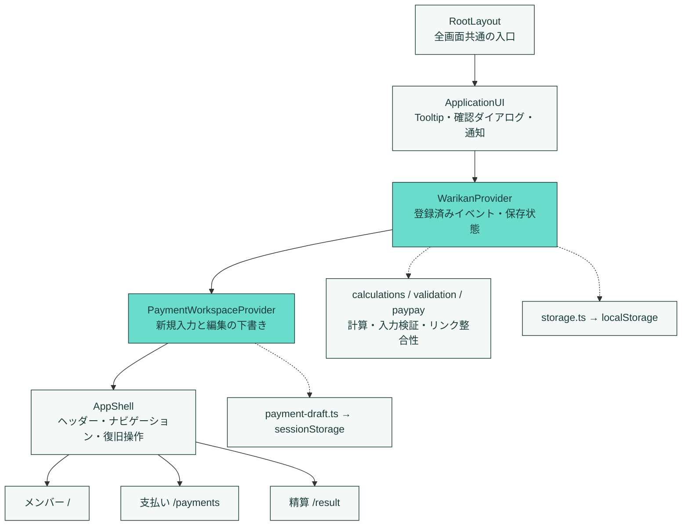

実線はレイアウト内の包含関係、点線は処理・保存先への依存です。ページは共有フックから状態と操作を受け取り、画面ごとに独立した台帳を持ちません。

### デザインを一か所から渡す

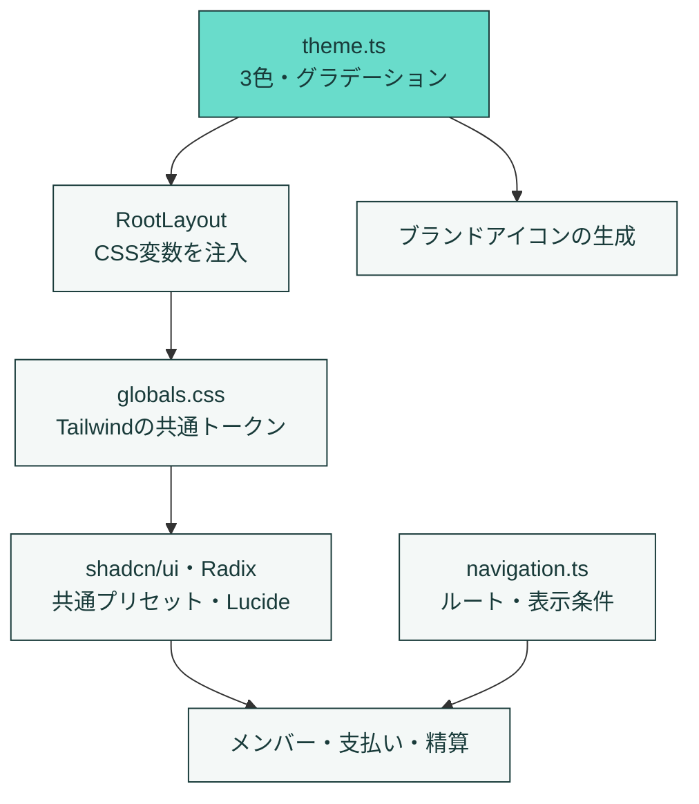

| 役割       | 基本色    | 用途                             |
| ---------- | --------- | -------------------------------- |
| メイン     | `#193B3A` | 文字・輪郭・濃い背景             |
| サブ       | `#F4F8F7` | ページやカードの明るい面         |
| アクセント | `#69DCCB` | 主要操作・ミントのグラデーション |

淡い面やグラデーションはこの3色から派生させます。角丸、太い輪郭、ずらした影、ミントの背景を共通化しています。変更時は[デザイン管理ガイド](docs/DESIGN_SYSTEM.md)を参照してください。

### 主なファイル

| 場所                                                                                                  | 責務                                       |
| ----------------------------------------------------------------------------------------------------- | ------------------------------------------ |
| [`src/app/layout.tsx`](src/app/layout.tsx)                                                            | 全画面のProviderと共有レイアウト           |
| [`src/app/useWarikanStore.tsx`](src/app/useWarikanStore.tsx)                                          | イベント操作・保存・競合と復旧・精算の導出 |
| [`src/components/PaymentWorkspace.tsx`](src/components/PaymentWorkspace.tsx)                          | タブ内の新規・編集下書き                   |
| [`src/components/AppShell.tsx`](src/components/AppShell.tsx)                                          | 共通画面枠・リフレッシュ・復旧操作         |
| [`src/components/PaymentEditor.tsx`](src/components/PaymentEditor.tsx)                                | 金額・支払者・対象者の入力                 |
| [`src/components/PaymentHistory.tsx`](src/components/PaymentHistory.tsx)                              | 履歴検索・ページング・編集操作             |
| [`src/lib/calculations.ts`](src/lib/calculations.ts)                                                  | 円単位の配分・精算・共有テキスト           |
| [`src/lib/storage.ts`](src/lib/storage.ts)                                                            | 保存形式・チェックサム・互換性・復旧       |
| [`src/lib/payment-draft.ts`](src/lib/payment-draft.ts)                                                | 下書き形式・イベントとの照合・選択の保持   |
| [`src/lib/paypay.ts`](src/lib/paypay.ts)                                                              | URL検証・精算内容との紐づけ                |
| [`src/design/theme.ts`](src/design/theme.ts) / [`src/config/navigation.ts`](src/config/navigation.ts) | 全画面に渡す色・ルート・表示条件           |
| [`src/components/ui/`](src/components/ui/)                                                            | shadcn/uiの基礎部品と共通プリセット        |

主な技術はNext.js 15.5、React 19、TypeScript 5.9、Tailwind CSS 4、shadcn/ui（Radix）、Lucide、Sonnerです。正確な依存バージョンは[`package.json`](package.json)と[`pnpm-lock.yaml`](pnpm-lock.yaml)、PostCSSの上書き等は[`pnpm-workspace.yaml`](pnpm-workspace.yaml)を参照してください。

## テスト

### ローカルで再現する

```sh
# 静的検査・単体テスト・本番ビルド
pnpm check
pnpm format:check
pnpm audit --audit-level=high

# ブラウザを導入し、本番ビルドに対して操作テスト
pnpm exec playwright install chromium webkit
pnpm test:e2e --workers=3

# 特定の環境だけ
pnpm test:e2e --project=mobile-webkit

# 大量データの保存処理を計測
pnpm benchmark:storage
```

`pnpm check`はESLint・デザイン規約・未使用コード・型・単体テスト・本番ビルドを含みます。個別実行は`pnpm lint`、`pnpm check:unused`、`pnpm typecheck`、`pnpm test`、`pnpm build`です。

ブラウザテストは既定で`http://127.0.0.1:3100`を使い、ローカルでは既存サーバーを再利用します。検証対象のビルドが起動していることを確認してください。起動していなければテストが本番サーバーを起動します。複数のテスト実行を並行させる場合は、`--output=artifacts/任意の別ディレクトリ`で結果の保存先を分けてください。

```sh
# 公開URLを対象にする例。ローカルサーバーは起動しません
PLAYWRIGHT_BASE_URL=https://warica.vercel.app pnpm test:e2e --workers=2
```

### 検証範囲

| 層         | 主な検証                                                                                    |
| ---------- | ------------------------------------------------------------------------------------------- |
| 計算       | 対象者別の配分・端数・複数支払者・100種類の台帳で総額保全と精算完了                         |
| データ     | 不正入力・破損JSON・旧形式・保存容量・読み書き拒否・再試行・競合                            |
| 操作       | 初期値・追加編集削除・矢印移動・下書き・リフレッシュ・検索・共有・復旧                      |
| 外部リンク | PayPay URLの検証・保持・変更時の無効化・リンクの受け渡し                                    |
| UI         | 右側のタップ領域・長い文字・横スクロール・キーボード・フォーカス・axeによるアクセシビリティ |
| 大量データ | 6,000件を保存した状態での入力と即時再読み込み、履歴の表示件数制限                           |

2026-09-14のローカル検証では、単体**35件成功**、ブラウザ操作**131件成功・対象外1件**を確認しました。ブラウザはChromiumのPC（1440×1100）・スマホ（320×800）、WebKitのスマホ（390×844）の3構成です。対象外の1件はスマホ専用レイアウト検査のPC実行です。追加で縦横表示・タブレット・PCの7サイズも確認しています。テスト件数はこの時点の記録です。

スマホはブラウザのエミュレーションです。実機のソフトウェアキーボード、OS共有画面、PayPayアプリ起動・実送金、手動スクリーンリーダー検査は含みません。PayPayのブラウザテストは架空リンクへの通信を遮断・置換します。自動検査の成功は完全なアクセシビリティ適合の証明ではありません。

### CIの流れ

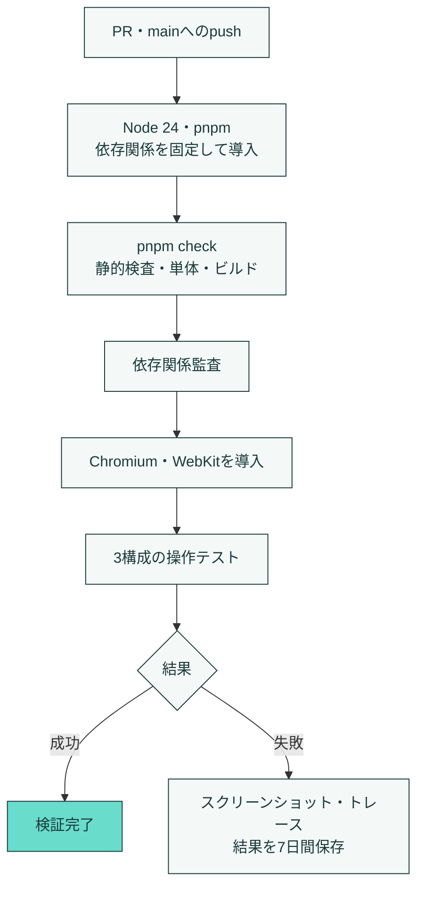

定義は[GitHub Actions](.github/workflows/ci.yml)、ブラウザ構成は[`playwright.config.ts`](playwright.config.ts)を参照してください。CIは2ワーカー、失敗時の再試行は1回です。ローカルの既定では再試行しません。CI成功と公開サイト・実機での動作確認は別々に扱います。

## 関連ドキュメント

- [確認済み状態](docs/STATUS.md)：検証対象・日時・結果・未確認の範囲
- [残課題](docs/BACKLOG.md)：WAR-ID、優先度、状態、再現条件、完了条件

- [デザイン管理ガイド](docs/DESIGN_SYSTEM.md)：色・共通部品・画面構成の変更方法
- [保存性能の計測](docs/STORAGE_PERFORMANCE.md)：計測条件、ブラウザI/Oを含む範囲との違い
- [公開環境の検証記録](docs/PRODUCTION_VERIFICATION.md)：記載された日付・コミット時点の履歴。現在のUI・本番状態の保証ではありません

README内の図はMermaid形式です。GitHub上で表示でき、テキストとして変更・レビューできます。
